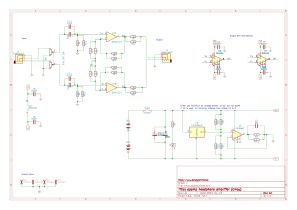

# cmoy_opamp
flexible cmoy style headphone amplifier

it can fit dual or single Op Amp´s, even a ZIF socket is possible for fast Op Amp changes.

The schematics:

It looks a bit strange, but its to fit both SMD and THT parts, and the different Op Amps.

One selection was made specifically, thats the virtual ground with a resistor voltage divider and voltage follower with the LMH6642. Like this it adds another Op Amp, fitting the Op Amp challenge better.
